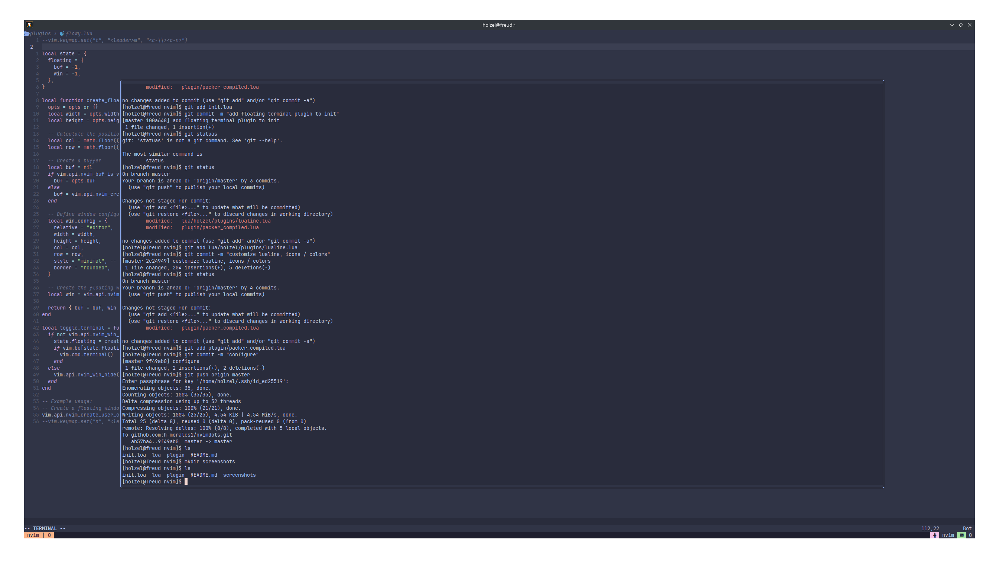

# Custom nvim configuration

- keybinds configured to work with tmux
- theme set (catppuccin-frappe)

# Controls

- Leader key: SPACE
- Search filenames in working dir: SPACE + .
- Search string in files in working dir: SPACE + \*
- Split window(vertically): SPACE + w + v
- Split window(horizontal): SPACE + w + s
- Show dir explorer: SPACE + e

# Open floating terminal: SPACE + tt

